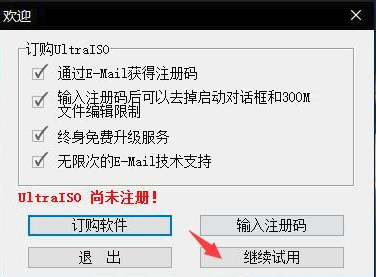
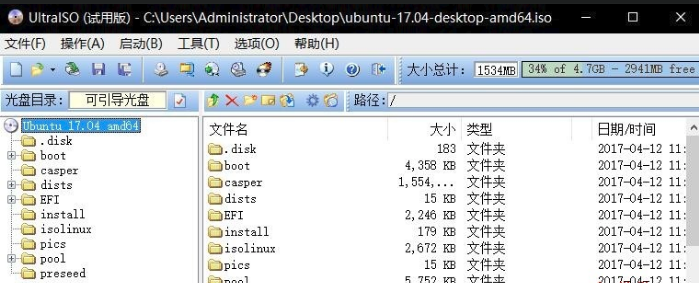
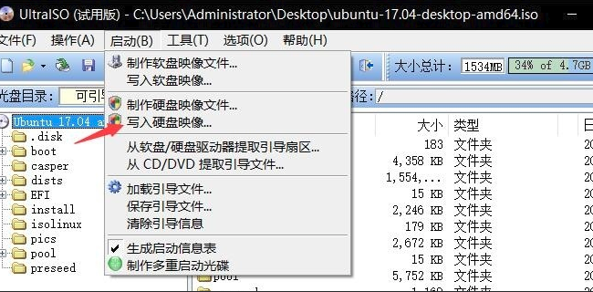
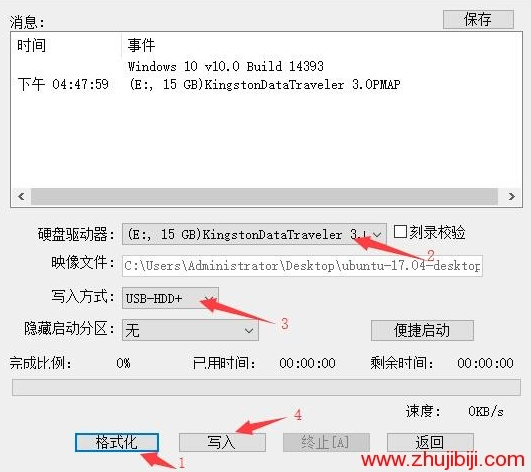
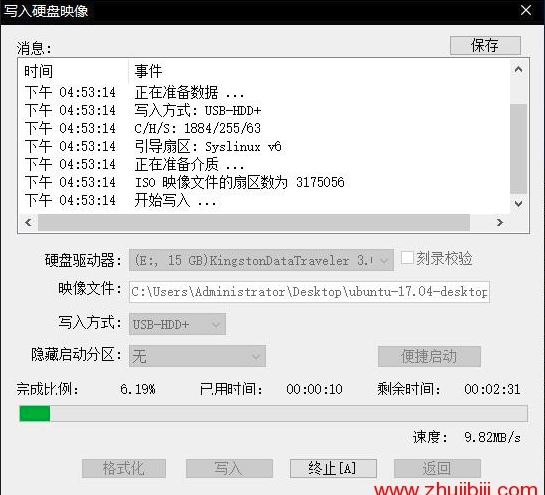

# 安装和配置ubuntu

本文主要描述重装/安装ubuntu系统后的主要配置。

## 笔记本安装linux系统

本文以安装ubuntu为例而展开。

参考：
https://cloud.tencent.com/developer/article/1046051

最近脑子发热突然很想学习linux，希望linux作为使用MAC前的一个踏板，另外陪伴自己10余年的笔记本电脑已经明显跟不上时代的步伐，windows从一定意义上非常不好使，种种原因加速了用老笔记本电脑来安装linux的动力，怎么着都得让笔记本在丢掉之前再次发挥一下余热。

本人HP probook 4411亲测下来可以安装ubuntu 14/18.10，而ubuntu 16/18.04在安装过程中都会出现问题。

### 制作Linux系统U盘

- 准备一个超过5GB的U盘，备份其中的数据因为后续要格式化
- 官网下载ubuntu的iso镜像文件
- [软碟通官网](https://cn.ultraiso.net/xiazai.html) 下载utraiso，试用版即可，只要能够在U盘作出一个启动盘
  
  

- 然后再软件打开我们的linuxiso镜像，文件-打开-选择
  

- 然后把这个系统写入到u盘上边去,启动-写入硬盘映像

- 在写入之前需要先格式化u盘，选择FAT32即可，然后需要注意就是硬盘驱动器选择自己的u盘，写入方式为USB-HDD+，这里要看仔细，注意备份数据
  

- 耐心等待进度条，这一步完成之后u盘就做好了，可以插入笔记本装系统了

### 配置笔记本U盘启动/安装linux

- 首先把u盘插入笔记本，开机设置u盘为第一启动顺序，我用的HP按ESC进入bios，设置boot为usb  
- 根据傻瓜式的引导来安装ubuntu

## 20180520 ubuntu下运行windows程序

## 20180527 ubuntu配置shadowsocks client