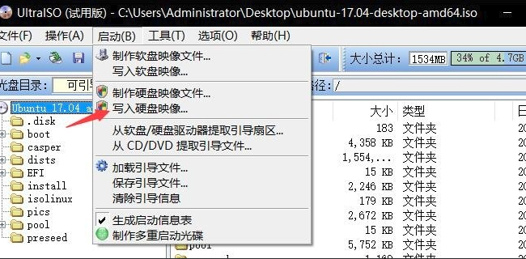
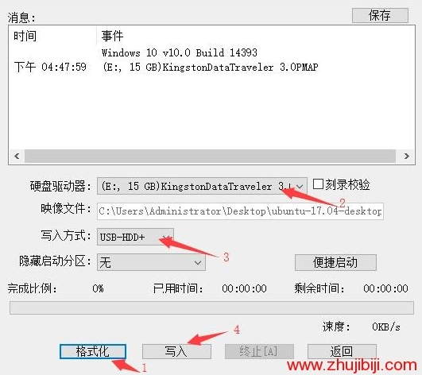

# 安装和配置ubuntu

本文主要描述重装/安装ubuntu系统后的主要配置。


## 笔记本安装linux系统

本文以安装ubuntu为例而展开。

参考：
https://cloud.tencent.com/developer/article/1046051

最近脑子发热突然很想学习linux，希望linux作为使用MAC前的一个踏板，另外陪伴自己10余年的笔记本电脑已经明显跟不上时代的步伐，windows从一定意义上非常不好使，种种原因加速了用老笔记本电脑来安装linux的动力，怎么着都得让笔记本在丢掉之前再次发挥一下余热。

本人HP probook 4411亲测下来可以安装ubuntu 14/18.10，而ubuntu 16/18.04在安装过程中都会出现问题。

### 制作Linux系统U盘

- 准备一个超过5GB的U盘，备份其中的数据到其他的移动硬盘因为后续要格式化这个U盘，所有数据都没用了
- 官网下载ubuntu的iso镜像文件
- [软碟通官网](https://cn.ultraiso.net/xiazai.html) 下载utraiso，试用版即可，只要能够在U盘作出一个启动盘
  
  

- 然后再软件打开我们的linuxiso镜像，文件-打开-选择
  


- 然后把这个系统写入到u盘上边去,启动-写入硬盘映像





- 在写入之前需要先格式化u盘，选择FAT32即可，然后需要注意就是硬盘驱动器选择自己的u盘，写入方式为USB-HDD+，这里要看仔细，注意备份数据
  


- 耐心等待进度条，这一步完成之后u盘就做好了，可以插入笔记本装系统了


### 配置笔记本U盘启动/安装linux

- 首先把u盘插入笔记本，开机设置u盘为第一启动顺序，我用的HP按ESC进入bios，设置boot为usb  
- 根据傻瓜式的引导来安装ubuntu


### 分区

在安装过程中分区感觉比较重要，如果选择傻瓜式默认分区，那就只有一个分区，没有/home分区意味着如果要重装，所有数据都会丢失。

如果有/home 分区，那么在重装时可以选择不去擦除该分区的数据，很多数据可以得以保留。

下面摘抄一段网上经验：

创建主分区： 150G 主分区 空间起始位置 分区格式为ext4 /
建议：安装系统和软件，分区尽量大设置大点

创建swap分区：2048MB 逻辑分区 空间起始位置 分区格式为swap 

交换分区相当于Windows中的“虚拟内存”，如果物理内存小于或等于512MB，建议分配交换分区的大小为物理内存容量的2倍；如果物理内存大于512MB，建议分配交换分区的大小等于物理内存容量；如果您的内存够大也可以不建立交换分区。

创建boot分区：1GB 逻辑分区 空间起始位置 分区格式为ext4 /boot
建议：400MB或1GB
启动分区，包含操作系统内核和启动的程序

创建home分区: 剩余的空间 逻辑分区 空间起始位置 分区格式为ext4 /home
建议： 相当于“我的文档”，分区尽量大设置大点


参考：
 - https://zhuanlan.zhihu.com/p/35294113
 - https://link.zhihu.com/?target=https%3A//blog.csdn.net/u012052268/article/details/77145427


### 使用LVM选项来安装

LVM据说提供了一个可以生成一个总的snapshot，以便于在系统每次重大变更后如果有异常crash可以用于backup。
据说LVM很强大，还可以集成多个Harddisk到一起，在Ubuntu安装时有一个选项可以选择LVM(目前选择了LVM就无法分区。。)

关于LVM的概念后续学习可以参考：
https://askubuntu.com/questions/3596/what-is-lvm-and-what-is-it-used-for


## 戴尔台式机安装Ubuntu的坑

本来以为台式机上面安装ubuntu更为简单，没想到还是要折腾一番。今天被戴尔台式机坑了一把。

### 硬盘模式设置为ACHI

进行安装时，看不到任何挂载盘，也就是说只能够识别安装的U盘，其他硬盘ubuntu看不到。

问题原因：DELL电脑BIOS中设置的SATA为RAID模式，而ubuntu不支持RAID模式，需要修改为ACHI模式。

解决方法: 开机f2进入BIOS 设置SATA模式

参考：
- https://blog.csdn.net/tulip561/article/details/73929512

### efi分区

由于目前电脑快速EFI启动，需要预留一个EFI分区(512 MB?  EXT4格式？)。


## ubuntu配置shadowsocks client


## 安装完ubuntu后要做的事情

### 下载安装chrome

https://www.google.cn/intl/zh-CN/chrome/

### 配置ssh

```
sudo apt update
sudo apt install openssh-server
```

### ubuntu下运行windows程序——Wine

不得不承认某些APP在windows下是很友好的，比如notepad++，在linux下不能直接使用。

在我们从Windows过渡到Ubuntu后，很多本来在Windows上玩的很熟的软件却无法在Ubuntu上运行。如果说应用软件还能在Ubuntu 上找到相应的替代品的话，那么Windows上的游戏就真的没辙了，现在热门的一些游戏几乎都没有Linux版本，当然也就无法在Ubuntu上运行了。 很多人虽然对Linux抱有很大的兴趣，但仍旧无法摆脱Windows，因为你不得不面对Linux上复杂的软件应用和无法运行热门游戏的现实。不过现在 Linux已经不再像以前那样和Windows毫无瓜葛了，我们只要借助一款名为“Wine”的软件就可以架起Linux和Windows的桥梁，在 Ubuntu上运行Win程序和游戏不再是梦想。

#### 什么是Wine？

[Wine](https://www.winehq.org/)是 Wine Is Not an Emulator 的所写，是一个在Xwindows和Unix上执行的Windows APIs，也可以认为Wine是一个Windows兼容层。通过Wine，我们可以在Ubuntu中运行windows程序。

在Ubuntu中，可以通过两种方法安装Wine，一种是自己编译Wine代码，另一种是直接下载安装。自己编译Wine代码的好处是编译好的Wine兼 容性好，在运行程序时很少会出现问题，比较稳定，缺点是步骤麻烦。下载安装Wine的好处自然是方便，缺点就是不稳定，经常容易出现问题。这里还是推荐大 家自己编译Wine，如果编译不成功，再通过下载安装Wine。

因为只想快速使用notepad++，我选择了[直接下载的方式](https://wiki.winehq.org/Ubuntu)

参考连接：
https://blog.51cto.com/vincent/100851


### 配置阿里镜像使用apt-get update速度更快

https://blog.csdn.net/feiniao8651/article/details/60332535
