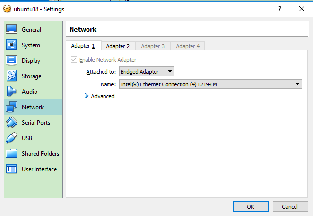

# 20190605 VirtualBox配置各种网络

早期由于比较懒，加之刚接触virtualbox不久，配置最为傻瓜的NAT方式，完成后进入virtualbox后能够上网了就没有研究下去，这次需要动真格，需求是不仅仅是virtualbox中的guest linux要能够上网，外部的host windows和测试板子也要能够访问到虚拟机。

## 如何配置使得连接了网线的主机与虚拟机能够互相Ping通

### VirtualBox network setting

https://blog.csdn.net/beijihukk/article/details/53522681

https://www.douban.com/group/topic/15558388/

https://www.virtualbox.org/manual/ch06.html

https://stackoverflow.com/questions/28521535/requests-how-to-disable-bypass-proxy

## 概念性的东西