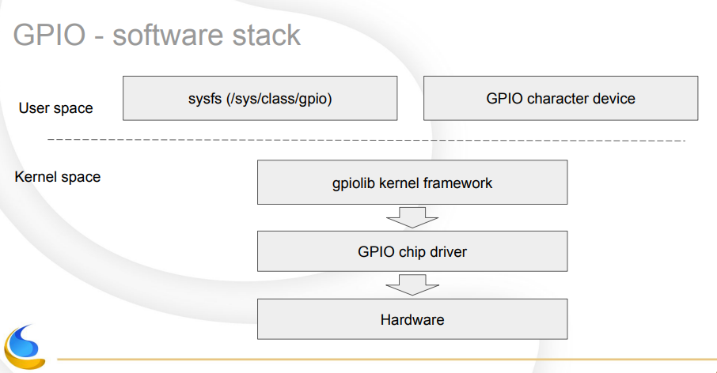

最近在测试一个看似比价弱鸡的东东——button和led，其中涉及到了GPIO的概念，很惭愧，为了这个
不懂的东西还闹出了一个笑话，这里先抛个砖，后续如有再次接触，再继续研究。

# Reference

- Packt.Mastering.Embedded.Linux.Programming.2nd.Edition.2017.6
- [GPIO 概念](https://www.ccarea.cn/archives/215)
- [GPIO 编码之 libgpiod github](https://github.com/brgl/libgpiod)
- [GPIO 编码之 libgpiod ppt intro](https://linuxpiter.com/system/attachments/files/000/001/532/original/Linux_Piter_2018_-_New_GPIO_interface_for_linux_userspace.pdf?1541021776)
- [GPIO 编码之 libgpiod 的用法](https://www.cnx-software.com/2017/11/03/learn-more-about-linuxs-new-gpio-user-space-subsystem-libgpiod/)
- [sysfs vs libgpiod](https://blog.adafruit.com/2018/11/26/sysfs-is-dead-long-live-libgpiod-libgpiod-for-linux-circuitpython/)

# GPIO 之概念

贴一下概念，GPIO全称是General Purpose Input Output （通用输入/输出）。广义上来说它并不是类似USB、DVI、HDMI这样一种特定协议的接口，而是通用接口的总称。对于了解单片机的人来说应该非常熟悉，而对于我们这些纯软件开发，没有接触过单片机的人来说，并不是很好弄清楚到底是个什么东西。 下面是维基百科的定义：

A general-purpose input/output (GPIO) is an uncommitted digital signal pin on an integrated circuit or electronic circuit board whose behavior—including whether it acts an input or output—is controllable by the user at run time.

从上面总结出几点：

- 数字针脚（可以是集成电路上的针脚，比如CPU或位处理器的针脚；也可以是开发板比如树莓派、Arduino上提供的GIPO接口）
- 可以用来输入或输出
- 运行时可控

# 输入输出

对于GPIO接口来说，最重要的就是输入和输出功能。对于计算机来说能识别的只有0和1，而对于数字电路来说通过高低电平来表示输出的值是0还是1。 因为树莓派GPIO接口的电压是3.3V。所以用3.3V表示高电平，也就是1，而用0V表示低电平，也就是0。一般来说高低电平会是一个电压范围。

在买外设的时候发现，有些设备是5V高电平，有些是3.3V。了解到单片机分为3.3V和5V，就是指的是GPIO接口的电压。如果用GPIO口产生一个3.3V的高电平给一个5V的设备，可能会被认为是低电平，如果直接接上一个5V设备作为输入电平，可能会导致树莓派烧坏。所以使用外设是要注意这个外设的电压是5V还是3.3V。

当GPIO用做输入时，会有高电平、低电平、高阻态三个状态。高阻态，指的是电路的一种输出状态，既不是高电平也不是低电平，这个时候因为状态不确定，读取GPIO时可能会导致数据不正确。所以引入了上拉和下拉电阻的概念。

上拉电阻：电阻一端接VCC，一端接逻辑电平接入引脚(如单片机引脚)
下拉电阻：电阻一端接GND，一端接逻辑电平接入引脚(如单片机引脚)

# GPIO数据传输

重点来了，和外设之间进行通信主要通过GOIP接口进行输入和输出。GPIO接口提供了可编程的方式从外设读取或向外设发送状态数据。

- 通过控制控制高低电平可以输出不同状态，所以用做开关控制是非常简单有效的。

- 作为输入时可以读取数值或者是状态。虽然每次只能传递0和1这样的数据，但是多次连续传递0和1组合起来，就可以传递复杂的数据。 比如温度传感器就是用GPIO口通过单总线协议进行数据交换。 通过GPIO可以进行各种协议的通信。

简单一点，GPIO的输入是**只读**的，GPIO的输出是**可写**的，一般情况下对于button，连接到的是GPIO的输入，application通过轮询或者中断方式监测输入的高低电平，对于LED，连接到的是GPIO的输出，application通过API来写高低电平从而控制LED的亮灭。

# 利用GPIO 编程

## GPIO software stack

要利用GPIO来编码，控制GPIO，首先要了解下GPIO的软件层次结构，通过下图可以了解，软件stack最上层为user space，既直接与application交互的层，目前存在两种方式，一种是基于sysfs，另一种则是基于GPIO character device的libgpiod。

在他们的下层是kernel space,可以看到user space的library也是调用的gpiolib kernel framework，而后到GPIO chip driver，最后就是硬件。

## Sysfs VS libgpiod

在Linux 4.8之前，user space用sysfs来控制GPIO(定义在/sys/class/gpio)，从linux 4.8开始，sysfs会被逐渐废弃，取而代之的是一个新的接口叫做libgpiod。

libgpiod is intended to be a fast kernel-level-supported method for writing/reading/monitoring GPIO pins on various linux boards, replacing the two main methods we see these days: sysfs file pokin’ and devmem twiddling.