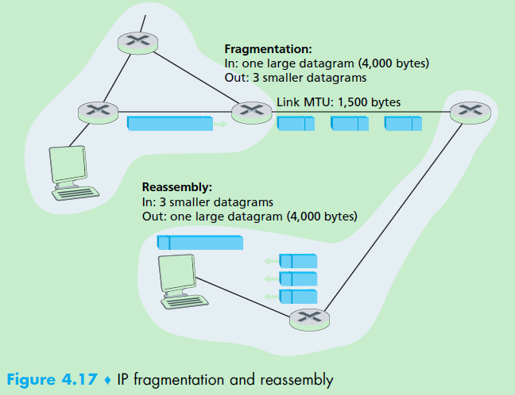

application layer-->Transport Layer (TCP/UDP)--> Network Layer data panel (IP) --> Network layer control panel --> Link Layer

## reference

- Computer networking
- https://thenetworkway.wordpress.com/2014/07/02/ipv6-address-assignment-stateless-stateful-dhcp-oh-my/

## Ipv4


- Time-to-live. The time-to-live (TTL) field is included to ensure that datagrams
do not circulate forever (due to, for example, a long-lived routing loop) in the
network. This field is decremented by one each time the datagram is processed by
a router. If the TTL field reaches 0, a router must drop that datagram.

### Ipv4 分段fragment

以太网帧Ethernet Frames理论上最大能够承载1,500 bytes的数据，世纪中wide-area links只能够承载不超过576 bytes的数据。

link-layer frame能够承载的最大传输单元成为maxium transmission unit(MTU)。IP datagram封装在link layer frame中由一个router传递给另一个router，而不同的router可以使用不同的link layer protocol，导致了使用不同的MTU。

如果IP dategram从一个支持大MTU的router转发到小MTU的router，大MTU的router就会将IP datagram进行分段，也就是fragment。

Fragments会在目标机器传递到transport layer之前进行重组。即，TCP/UDP希望从Network layer得到的是完整的没有分段的数据。重组只会发生在端到端的两端，不会发生在router上。（所以router不会有network layer?)



### Ipv4 addressing

Ipv4 中IP地址与网卡interface绑定(对于Ipv4,一个Interface一个IP地址？？而Ipv6一个interface可以有多个IP)

格式：32 bits long (4 bytes), 最大2的32次方个IP 地址。


子网掩码subnet mask: 223.1.1.0/24中的/24，表示32位中的leftmost 24 bits属于subnet address。

上图中host interface(233.1.1.1/233.1.1.2/233.1.1.3)以及router interface
(233.1.1.4)组成了一个子网223.1.1.0/24。


对于子网subnet的定义，看上面这张图会清晰一些，上图中，223.1.1.0/24, 223.1.2.0/24, 和 223.1.3.0/24三个子网与之前图4.18比较类似，除此以外还有三个子网：
- 223.1.9.0/24, R1与R2连接的子网
- 223.1.8.0/24, R2与R3连接的子网
- 223.1.7.0/24, R3与R1连接的子网


#### 无类别域间路由选择 Classless Interdomain Routing (CIDR—pronounced cider) [RFC 4632]

- CIDR的定义

将32-bit的IP地址划分为两个部分，a.b.c.d/x，x表示 x most significant bits（第一部分），通常
称为network prefix，一个organization通常有相同的第一部分，在Organization外部的router向
Organization转发数据时只需识别network prefix部分，这样就会减少router里面转发表的size。

剩下的bit为第二部分，最为Organization内部使用，在内部也可以有各种subnet，比如，a.b.c.d/21是
orgnization的network prefix，内部就可以定义一个a.b.c.d/24作为一个organization内部的subnet。

在CIDR被正是采纳之前，network 的prefix是固定的8, 16, 24bit这样的长度，既所谓的A/B/C类地址。
但是这样划分会有一些问题，不灵活，无法很好的支持日益增长的IP需求，比如一个C类地址(/24)subnet，
一共可以有2的8次方减2=254个hosts(减去的两个是保留地址)，254个对于一个Organization可能太少了,
假设这个organization有2000个Hosts,而如果给其B类地址(65534个)subnet，又白白浪费了63000个地址(
其他orgnization无法使用)。

- 利用CIDR寻址


如上图，ISP: Fly-By-Night-ISP 对于外界使用200.23.16.0/20(前20bit)来通信，外接只知道
这个ISP的地址是200.23.16.0/20，并不知道在这个ISP内部还有8个其他的organization，每一个
都有自己的subnets存在，这种使用单个前缀来表示多个network的能力称为**地址聚合address 
aggregation(或者是路由聚合route aggregation/summarization)**。

当然还有一种其他的情况，想下，如果Fly-By-Night-ISP中的Organization 1连接到了另一个ISPs-R-Us中，而ISPs-R-Us本身对外地址为199.31.0.0/16, 显然Organization 1的IP地址超出了这个范围，接下来怎么办呢？

比较花开销的做法是Organization 1对内部所有的routers和Hosts重新划分地址，但代价太大。有一个方法可以让该组织无需重新分配地址，Fly-By-Night-ISP继续advertise 200.23.16.0/20 , ISPs-
R-Us继续advertise 199.31.0.0/16，同时advertise 200.23.18.0/23, 当网络外部的router同时遇到
200.23.16.0/20 (from Fly-By-Night-ISP) and 200.23.18.0/23 (from ISPs-
R-Us)时，并想要把数据发给200.23.18.0/23时，会使用长匹配，即挑选最长的network prefix来匹配。


#### Organization内部分配一系列的地址规则

如果一个ISP的地址快是200.23.16.0/20 11001000 00010111 00010000 00000000,里面的organization的地址可以这么分：
Organization 0 200.23.16.0/23 11001000 00010111 00010000 00000000
Organization 1 200.23.18.0/23 11001000 00010111 00010010 00000000
Organization 2 200.23.20.0/23 11001000 00010111 00010100 00000000
… … …
Organization 7 200.23.30.0/23 11001000 00010111 00011110 00000000


### DHCP Dynamic Host Configuration Protocol (DHCP) [RFC 2131]

这个是IPV4下Host获取IP地址的一种方式(IPV6的成为DHCPV6), 除了分配IP地址外，host还能够通过DHCP来获取一些其他的信息比如：subnet mask, default gateway, NTP server， DNS server地址等。

我们可以配置DHCP server每次都给某个设备分配相同的IP地址，也可以每次分配不同的地址。


通常在每一个subnet中有一个DHCP server，如果没有，那么一个DHCP relay agent(通常来说就是一个router)会知道DHCP server的地址。

如上图，DHCP server在subnet 223.1.2/24, 旁边有个router连接了223.1.1/24和223.1.3/24就是一个relay agent

对于新加进来的HOST的DHCP过程，4步：


- **DHCP server discovery**.

Host先准备UDP包(67端口)DHCP server discovery，该UDP包被封装到一个IP datagram中发送出去。
目标IP地址填写为广播地址255.255.255.255，源地址为0.0.0.0(表示this host). DHCP client将准备好的IP datagram交给link layer，由后者广播到subnet中所有与Host相连的nodes。

- **DHCP server offer(s)**. 

DHCP server收到了DHCP discover消息，回复时仍旧使用255.255.255.255的广播地址，广播到subnet的所有nodes，采用广播而非单播是因为在subnet中可能有多个DHCP server的存在，client需要选择其中的一个。

回复client的消息可以包含：the transaction ID of the received discover message,
the proposed IP address for the client, the network mask, and an IP address
**lease time**—分配的IP地址有效时间，通常设置为几个小时或者几天[Droms 2002].

- **DHCP request**
client会从一个或者多个server的Offer中选择一个并对其进行回复DHCP request消息，将收到的Offer消息中的配置信息在DHCP request中原封不动的传递回去。

- **DHCP ACK**
server回复DHCP request消息，确认请求生效。

一旦client收到DHCP ACK，DHCP过程就完成了，client可以在lease time时间内使用DHCP过程中分配的IP地址。

details about DHCP can be found in [Droms 2002] and [dhc 2016]. 
An open source reference implementation of DHCP is available from the Internet Systems Consortium [ISC 2016].

### Network Address Translation (NAT)

#### 概念


network address translation (NAT) [RFC 2663; RFC 3022; Huston 2004, Zhang
2007; Cisco NAT 2016].

上图展示了一个NAT-enable的router。右边部分是家庭网络，subnet 地址为10.0.0/24。(10.0.0.0/8 是[RFC 1918]定义的三个保留网段之一，针对私有地址)

NAT-enable的router对外的行为看上去不像是一个router而是一个有单独IP地址的设备device。如上图，所有home内部通过router转发到Internet的数据对外只有一个源IP地址：138.76.29.7，对应地，所有Internet到Home的数据目的IP地址也是相同的138.76.29.7。NAT-enable的router以及home内部设备的IP地址均通过DHCP获取，router通过DHCP从外部ISP的DHCP server获取IP地址，home内部设备通过router自带的DHCP server获取IP地址。

在外部过来的数据都是同一个IP地址的情况下，router又是如何做到将这些数据区分分发到内部不同的host设备呢？答案就是使用NAT translation table ，将端口号和IP地址包括在table中。

仍然是用上图举例，用实例看下NAT如何工作：

- 假设用户使用Host 10.0.0.1发送了一个web page请求，端口号80，目的IP地址为128.119.40.186
- host 10.0.0.1会在assign一个随机的源端口号3345在发送的数据请求中
- NAT router收到该数据后会产生一个新的源端口号5001，替换原先源端口号，并同时替换源IP地址为138.76.29.7，产生新端口号的策略为，在当前NAT translation table中找不存在的Port号。router的NAT模块会将该实体保存到NAT translation table中。
- port number是16 bits，因此理论上单个router中可以同时存在超过60,000个链接
- Web server对端口号5001回复响应数据，当数据到达NAT router后，router会使用目的IP地址和目的端口号查询NAT translation table，得到最终的IP地址(10.0.0.1)和端口号(3345)，并将响应数据中的IP地址和端口号替换为查询结果，将改过的数据转发到内部对应的home host。


#### 争议

NAT has enjoyed widespread deployment in recent years. But NAT is not without
detractors. First, one might argue that, port numbers are meant to be used for
addressing processes, not for addressing hosts. This violation can indeed cause problems
for servers running on the home network, since, as we have seen in Chapter 2,
server processes wait for incoming requests at well-known port numbers and peers in
a P2P protocol need to accept incoming connections when acting as servers. Technical
solutions to these problems include NAT traversal tools [RFC 5389] and Universal
Plug and Play (UPnP), a protocol that allows a host to discover and configure
a nearby NAT [UPnP Forum 2016].
More “philosophical” arguments have also been raised against NAT by architectural
purists. Here, the concern is that routers are meant to be layer 3 (i.e., network-
layer) devices, and should process packets only up to the network layer. NAT
violates this principle that hosts should be talking directly with each other, without
interfering nodes modifying IP addresses, much less port numbers. 


## Ipv6

IPV4终将耗尽，替代品就是IPV6。


在IPV6的世界里，每个interface至少会有一个Link-Local 地址，IPV6协议栈会等待某个Interface获得了Link local地址并且通过了Duplicate Address Detection (DAD) 验证后才开始工作。

### IPV6 地址获取方式

- 静态赋值， 和IPV4一样
- Stateless Address Auto Configuration (SLAAC)

应该是指设备可以结合Interface的MAC地址加上router advertisement的link prefix来生成一个IPV6地址。
这个应该就是默认的Link local地址，生成方式参考：https://networkengineering.stackexchange.com/questions/23958/understanding-the-difference-between-eui-64-and-ipv6

- Stateless DHCPv6

用于获取DNS/NTP等信息。
DHCP server不会记录任何client的状态。


- Stateful DHCPv6 

过程与IPV4 的DHCP类似，服务器在提供一些信息时会记录client的状态。


### work problem

工作中遇到过测试板子在IPV6 enable并且可以通过IPV6正常工作的情况下，始终无法发起IPV6的NTP时间同步请求，原因可能是这个IPV6只是link local的地址，没有通过DHCPV6来配置DNS/NTP的信息。


### 扩展阅读 Linux的IPV6

https://mirrors.deepspace6.net/howtos/Linux%2BIPv6-HOWTO/index.html


### 遇到的问题

- Ipv6如何访问

**格式[XX.XX.XX.XX%AA]:port**

其中百分号分割了interface(zone id)部分和network address部分，因为IPV6下一个Interface可以有多个IPV6地址，因此每个IPV6的请求都需要加上用于识别通过哪个interface的标号，用zone id表示。

**Linux下ping IPV6**
```
ping6 -I eth0 fe80::21a:a5ff:fec1:1060
```


参考：
https://tools.ietf.org/html/rfc3986.html

https://tools.ietf.org/html/rfc6874.html
