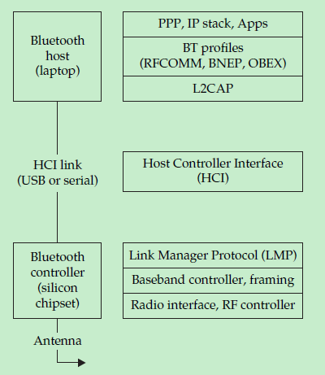
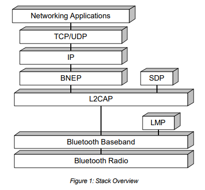
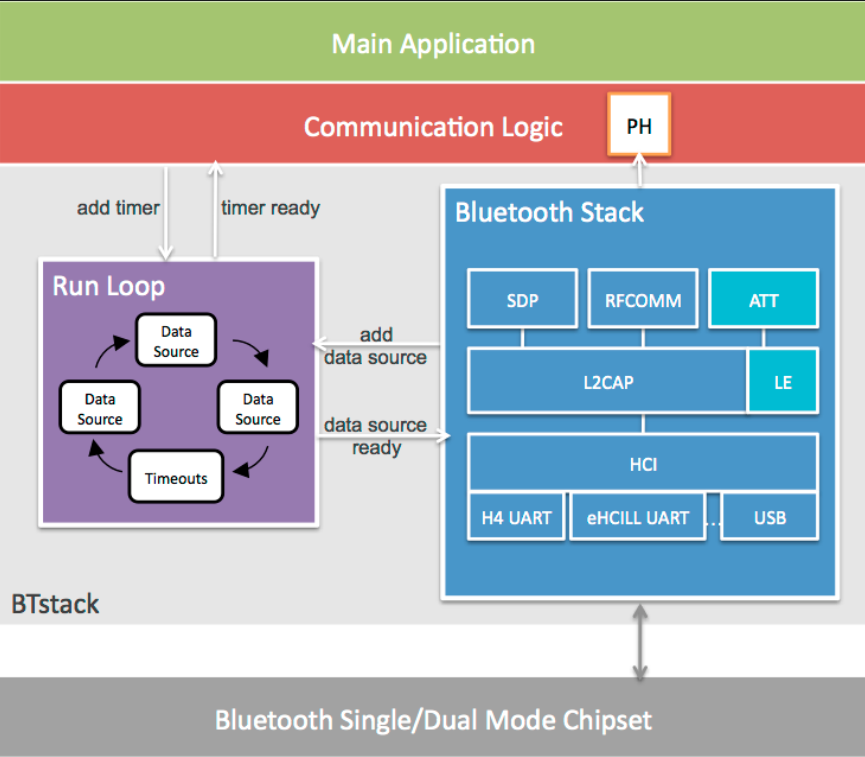

# BR/EDR

测试对象是基于Linux BlueZ作为host的BNEP/PAN连接。BNEP/PAN是一个Bluetooth Profile。

## Reference

[1] Hacking.Exposed.Wireless.3rd.Edition.2015.3.pdf

[2] Core_v4.2.pdf (蓝牙协议)

[3] http://grouper.ieee.org/groups/802/15/Bluetooth/PAN-Profile.pdf

[4] http://grouper.ieee.org/groups/802/15/Bluetooth/BNEP.pdf

[5] [BREDR和LE不同](https://engineering.stackexchange.com/questions/12311/what-is-the-difference-between-bluetooth-low-energy-and-bluetooth-br-edr-in-park)

[6] [BREDR和LE不同2](https://stackoverflow.com/questions/39592435/pairing-differences-between-bluetooth-and-bluetooth-le)

## Basic

以下参考[1] Part II Chapter 7， 蓝牙词汇均表示经典蓝牙。

经典蓝牙在基于2.4-GHz ISM band上定义了79个信道，每一个有1-MHz宽。经典蓝牙设备以每秒
1600次的速度(约每625微妙一次)的速度在这些信道上不断跳跃，这就是所谓的Frequency Hopping 
Spread Spectrum (FHSS)。经典蓝牙的最大速度是 3 Mbps，最大距离是100米。FHSS技术能够很好地
通过在不同RF频谱间的跳跃降低干扰信道。FHSS provides robustness against noisy channels 
by rapidly moving throughout the available RF spectrum.

在经典蓝牙中，两台设备要通信就需要在同一时间处于同一个信道并且有一样的跳跃节奏。用蓝牙连接的
网络中有一个master，最多7个slave，只有master和slave间存在通信。

一个蓝牙网络有非常多的协议，通常分为两大部分: Bluetooth controller和Bluetooth host。
前者是指电脑上bluetooth chip或者是USB dongle适配器，后者通常指电脑。

下图就是经典蓝牙协议栈的组成，controller负责frequency hopping, baseband encapsulation
向host传递相关结果。host 负责高层协议。HCI连接是两者的接口。




- Radio Frequency Communications (RFCOMM)
RFCOMM is the transport protocol used by Bluetooth devices that need reliable streams-based transport, analogous to TCP. The RFCOMM protocol is commonly used to emulate serial ports, send AT commands (Hayes Command Set) to phones, and to transport files over the Object Exchange (OBEX) protocol.

- Logical Link Control and Adaptation Protocol (L2CAP)
L2CAP is a datagram-based protocol, which is used mostly to transport higher-layer protocols such as RFCOMM to other upper-layer protocols. An application-level programmer can use L2CAP as a transport protocol, operating similarly to the UDP protocol—as a message-based, unreliable, data-delivery mechanism.

- Host Controller Interface (HCI)
As mentioned previously, the Bluetooth standard specifies an interface for controlling a Bluetooth chipset (controller), leveraging the HCI interface layer. The HCI is the lowest layer of the Bluetooth stack that is immediately accessible to developers with standard hardware, accommodating remote device-friendly name retrieval, connection establishment, and termination.

- Link Manager Protocol (LMP)
The Link Manager Protocol (LMP) is the beginning of the controller protocol stack, making it inaccessible without specialized hardware. LMP handles negotiation such as low-level encryption issues, authentication, and pairing. Although the controlling host may be aware of these features and explicitly request them, the controller’s job is to determine what sort of packets need to be sent and how to handle the results.

- Baseband
Like the LMP layer, the baseband layer is inaccessible to developers without custom hardware tools. The Bluetooth baseband specifies over-the-air characteristics (such as the transmission rate), the final layer of framing for a packet, and the channel to use for transmitting and receiving packets.

测试对象BNEP/PAN是基于L2CAP上面的一个协议profile。

### Bluetooth Profiles

Bluetooth Special Interest Group(SIG)组织是蓝牙协议的制定者，同样制订了多个针对应用层的
profiles。profiles在host端实现，这样就可以不依赖controller在不同的系统下移植。

已知的profile包括Service Discovery Protocol (SDP), Advanced Audio Distribution Profile (A2DP), Headset Profile (HSP), Object Exchange Profile (OBEX), and Personal Area Network Profile (PANP)。


### Encryption and authentication

加密和鉴权实际上是由chip来完成，当然，加密和鉴权是Optional的，可以处于costsaving来决定
支持或者不支持加密和鉴权或者支持或者不支持其中之一。

鉴权通过传统的Pairing或者Secure Simple Pairing (SSP)。

- Traditional Pairing
The traditional pairing process was superseded in the Bluetooth 2.1 specification by the Secure Simple Pairing (SSP) exchange, though the traditional pairing exchange is still used by devices today as well. Using traditional pairing, when two devices first meet, they undergo a pairing exchange, in which a security key known as the link key is derived from a BD_ADDR, a personal identification number (PIN), and a random number. Once this exchange is completed, both devices store the link key information in local nonvolatile memory for use in later authentication exchanges and to derive encryption keys (when used).

If an attacker observes the traditional pairing exchange used to derive the link key, as well as a subsequent authentication exchange, then attacking the PIN selection is possible. Commonly, this is carried out in a PIN brute-force attack: a PIN guess is made and then used to derive a possible link key, and the guess is validated by comparing locally computed authentication results to those observed in the legitimate exchange. We’ll examine this attack in depth in Chapter 10.

- Secure Simple Pairing
The biggest problem with the traditional pairing scheme just outlined is that a passive attacker who observes the pairing can quickly recover the PIN and stored link key. If an attacker is able to recover the link key, he can decrypt all traffic exchanged over the Bluetooth network and impersonate legitimate devices. The Secure Simple Pairing (SSP) process attempts to prevent a passive observer from retrieving the link key, while also providing multiple authentication options for varying Bluetooth device types.
SSP improves the authentication exchange in Bluetooth by leveraging public key cryptography, specifically through the Elliptic Curve Diffie-Hellman (ECDH) exchange. A Diffie-Hellman key exchange allows two peers to exchange public keys and then derive a shared secret that an observer will not be able to reproduce. The resulting secret key is called the DHKey. Ultimately, the link key is derived from the DHKey for subsequent authentication and encryption key derivation.
By using a Diffie-Hellman key exchange, a strong shared entropy pool is available for deriving the link key on both devices. This strong entropy pool solves the biggest problem with the traditional pairing derivation, in which the sole source of entropy is a small PIN value.
Having completed an introduction to Bluetooth technology components, we’ll continue to examine Bluetooth from an attacker’s perspective. As we examine the various attacks against Bluetooth technology, we’ll dig into the related technology and components supporting this worldwide standard.

### BNEP/PANP

BNEP：Bluetooth Networking Encapsulation Protocol，协议主要定义BNEP包的格式



PANP：描述如何使用BNEP协议来提供基于蓝牙的网络能力，包含一些几点：
· Ethernet Encapsulation
· Single-Piconet IP PAN
· Master Forwarding
· Network Access Point-->被测对象支持


### 协议基本流程

对照参考[2] BLUETOOTH SPECIFICATION Version 4.2 [Vol 2, Part F] page 1061


# 测试工具BTstack

Linux有个通用协议栈BlueZ, 但是被测对象用了它，因此选了个不一样的协议栈，BTstack看下来比较
好用，同时支持BR/EDR和BLE，并且，最重要，有python binding，支持BNEP，因此选了它。

PyBlueZ看下来没有对BNEP有封装，需要自己实现。

## 基本信息

### 网站

https://github.com/bluekitchen/btstack

### 结构和特点

BTstack支持很多Platform下基于chip的和基于USB的蓝牙controller。

#### 目录

- chipset 当前支持的蓝牙chip 
- platform 支持的操作系统和MCU架构的platform源码
- port 支持MCU的整套application环境(有main.c)
- test	单元测试和PTS(协议一致性测试？)
- tool	一大堆工具，大部分用Python写的

#### 特点

BTstack最大的特点就是，协议栈中的每一层处理传递过来的event都有回调函数，也就是说，各种
回调函数，各种注册，因此，non blocking everywhere。另外，BTstack是单线程，可能相对比较
简单。

下图是BTstack架构，PH表示registered packet handler，BTstack有一个run loop，不断虚幻地
从队列读取数据处理，队列中的数据由协议栈放入，包括发送、接受的消息，timer资源等。



#### 配置和使用

测试使用的platform是daemon(/platform/daemon/),BTstack基于原有的蓝牙协议栈上增加了一个daemon，用于更好地
为其他语言(Java/python)服务，这个daemon的作用是起到上层应用于蓝牙协议栈的接口作用。


这里提几点测试要用的部分，基于ubuntu Linux环境。


- 重大改动

2019年8月取的分支上对于使用python binding来测试还是有不少bug，详细可以参考./resource/btstack.7z。
这边列举下一些针对测试用的重大改动，编译前需要注意。

a. 修改hci_transport_h2_libusb.c

为了适配买的bluetooth adapter，在判断USB描述符中将以下代码替换掉原先代码

```
if (desc.bDeviceClass == 0xEF && desc.bDeviceSubClass == 0x02 && desc.bDeviceProtocol == 0x01) {
            return i;
        }
```

b. 修改btstack_parser.py

原先函数commands右侧为=号，这样就只有daemon cmds被解析，hci cmds的解析结果被替换了。

```
def parse_commands(camel_case=True):
    global btstack_root
    commands = []
    commands = commands + my_parse_commands(btstack_root + '/' + hci_cmds_c_path, camel_case)
    commands = commands + my_parse_commands(btstack_root + '/' + daemon_cmds_c_path, camel_case)
    return commands
```

c. /btstack/port/libusb/Makefile

添加一下代码，支持panu_demo的编译

```
EXAMPLES += panu_demo
```


- python binding 的编译

编译：

1) 下载安装编译dependency和automake, autoconfig

`sudo apt-get update`
`sudo apt-get install gcc git libusb-1.0 pkg-config`
`sudo apt-get install automake autoconf`

2) 进/btstack/port/daemon/目录，运行`./bootstrap.sh`
3) 生成了configure, 运行`./configure`，会生成makefile
4) 运行`make`，在同级src目录下会生成libBTstack.so和libBTstackServer.so，前者就是
整个BTstack协议栈对外的API动态链接库，后者是针对daemon而言
5) 进入/platform/daemon/binding/python目录，执行make，这样会自动生成command_builder.py
和event_factory.py，用于HCI事件的收发
6) 修改btstack_types.py，增加unpack函数(见btstack.7z)，
7) 修改eventy_factory.py, 见btstack.7z的hzj注释，主要是原先Unpack的一些bug


清理：

1) `make clean`
2) 清除自动生成的File

运行：

1) 将libBTstackServer.so拷贝到/platform/daemon/binding/python/btstack下
2）进入/platform/daemon/binding/python目录，可以修改test.py，注册不同的
packet_handler函数(`btstack_client.register_packet_handler(packet_handler_sdp)`) 
3) 修改target device addr
4) 执行`sudo python3 test.py`

- 编译panu_demo, spp_streamer_client

这是两个用过的application

1)　进入/btstack/port/libusb
2)  看README，也可以直接`make`

- 编译classic_test和bnep_test

PTS(一致性测试？)用例

1) 进入/btstack/test/pts目录
2) 修改Makefile(见btstack.7z)
3) `make classic_test` 或者`bnep_test`


使用classic_test注意：

- 运行后先设置bondable/IO CAP
- 普通连接直接p
- 做鉴权的话做完普通连接后：z -> + -> *


# 其他测试工具的参考

以下是一些东东，还没有仔细研究，但值得一看

- [bluetoothctl 和PAN连接](http://blog.fraggod.net/2015/03/28/bluetooth-pan-network-setup-with-bluez-5x.html)
- [pybluez中使用bnep初探](https://blog.quarkslab.com/android-bluetooth-vulnerabilities-in-the-march-2018-security-bulletin.html)
- [pybluez example](http://blog.kevindoran.co/bluetooth-programming-with-python-3/)
- [用bluez来programming](https://people.csail.mit.edu/albert/bluez-intro/x95.html)

## 测试BNEP/PAN

- 小米手机

a. 开启蓝牙
b. 设置->更多连接方式->蓝牙共享

# Else

## USB path
因为用的是USB的adapter，BTstack有个输出是USB path:02

如果在插入适配器后ubuntu输入ls /sys/bus/usb/devices/会得到以下新增内容：
```
1-2  1-2:1.0  1-2:1.1  1-2:1.2
```

```
X-Y.Z:A.B

1-1.3:1.0

|_usb root hub - bus number - 1
  |_ port number - 1 of root hub
    |_port number - 3 of intermediate hub
      |_current configuration number - 1
        |_ current interface number - 0
        
```
X is the USB bus of your motherboard where is connected the USB system.
Y is the port in use on the bus system
Z is the port is use on an hub

https://stackoverflow.com/questions/33140787/determine-usb-device-file-path

https://stackoverflow.com/questions/14279796/linux-libusb-get-usb-device-path

