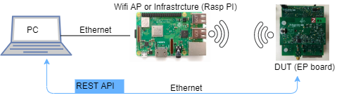

# Wifi testing environment setup

本篇说明用树莓派测试wifi


This document presents the Wifi testing envionment setup for both Wifi infrastructure and Wifi ap testing.

## Document Revision History

Version | Date (yyyy-mm-dd) | Authors | Changes
---- | ---- | ---- | ---- |
1.0.0 | 2019-11-14 | Steven HU | Initial draft

## Reference

[Design team research on Wifi frequency band](https://github.schneider-electric.com/iot-bridge/iot-bridge/blob/5fe95dccc24ebc13af970cb33acdc0914840e771/implementation/architecture/IOTB-3339-WIFI-Driver_configuration-Regulation-%26-2.4GHz-5GHz.adoc)


[Openwrt 19.07](https://forum.openwrt.org/t/openwrt-19-07-0-first-release-candidate/48040)

[Raspberry PI 3B+ Introduction](https://www.raspberrypi.org/products/raspberry-pi-3-model-b-plus/)

[Raspberry PI with Openwrt](https://openwrt.org/toh/raspberry_pi_foundation/raspberry_pi)

[User guide for Openwrt](https://openwrt.org/docs/guide-user/start)


## Test tool research 

- Raspberry PI

    The Raspberry Pi is a series of small single-board computers developed in the United Kingdom by the Raspberry Pi Foundation. Also it can be used for verification since its very handful to use when installed with specific Linux OS and especially it supports Wifi on hardware.

- Openwrt

    The OpenWrt Project is a Linux operating system targeting embedded devices.
Instead of trying to create a single, static firmware, OpenWrt provides a fully writable filesystem with optional package management. This frees you from the restrictions of the application selection and configuration provided by the vendor and allows you to use packages to customize an embedded device to suit any application. For users, this means the freedom of full customization, allowing the use of an embedded device in ways the vendor never envisioned.

- Luci

    This is the OpenWrt "luci"-feed containing LuCI - OpenWrt Configuration Interface which allows user to configure a Openwrt device on web service.

    In our automation test script, [JsonRpc API](https://github.com/openwrt/luci/wiki/JsonRpcHowTo) will be used.

- opkg

    Like most Linux distributions, the functionality of the opkg pakage management system can be upgraded rather significantly by downloading and installing pre-made packages from package repositories (local or on the Internet). We can install tools for verification using opkg command.


Currently we use Raspberry PI with Openwrt installed as test tool for Wifi testing.

Here lists three kinds of Raspberry PI and its suitable Openwrt version.

PI version(Openwrt version) | Testing on 2.4Ghz WLAN | Testing on 5Ghz WLAN |
---- | ---- | ---- |
3B(18.06) | support | X (not support) |
3B+(19.07rc1) | support | support |
4B(snapshot) | support | only support channel 36 |

NOTE:

i. Currently there is NO official Openwrt release for Raspberry PI 4B, only snapshot version is supported. 

ii. If you use Raspberry 3B+, do NOT choose release version under 19 like 18.06 for there is a [Wifi country code issue](https://forum.openwrt.org/t/cannot-use-channels-12-and-13-on-raspberry-pi-3-in-ap-config/3707/3).


## Test environment setup

Based on the research above, we decided to choose Raspberry PI 3B+ with Openwrt 19.07 installed as our automating testing tool for Wifi.

This section will describe the recommended hardware and software envionment for specific Wifi testing.

For better understanding, following lists an easy example test envrionment for Wifi testing. We use Raspberry PI as Wifi infrastructure or Wifi access point to test DUT serves as Wifi access point or Wifi infrastructure. The connection between PC and PI is ethernet for we want to use SSH to control the PI. The connection between PC and DUT is also ethernet for we want to use Forum REST API to get and put information on DUT.




* Testing DUT serves as either Wifi infrastructure or Wifi access point

    * Selection of Raspberry PI

        Here we choose Raspberry PI Model 3B+. We do not choose PI 4 because currently Openwrt do NOT support release version for PI4 and only snapshot version is supported. And we do not choose PI 3B because currently 5Ghz of Wifi is not supported by its hardware.

    * Downloading Openwrt

        The latest release version [19.07rc1](https://downloads.openwrt.org/releases/19.07.0-rc1/targets/brcm2708/bcm2710/) should be selected for its really has a great step forward on Raspberry 3B+ compared to the previous release version on Wifi feature.

        Normally we choose to download and unzip file: `rpi-3-ext4-factory.img.gz` as the image of Openwrt.

    * Format SD card and flash Openwrt into SD card

        On Windows, you can use [Win32DiskImage](https://sourceforge.net/projects/win32diskimager/) to copy the img file to your SD card's drive letter

        On Linux, you can refer to [How to flash Openwrt to an SD card](https://openwrt.org/toh/raspberry_pi_foundation/raspberry_pi)

    * Installing opkg package after installing Openwrt

        *  plug in one side ethernet cable on port of Raspberry PI and another side of cable on LAN of company and then try to connect Raspberry PI using SSH or directly by USB serial port

            If you choosing connect PI with SSH, you need to know the IP address of PI. Now after flashload, the inital IP address of PI is set to `192.168.1.1` , you can get this IP address by inspect `/etc/config/network` and check the `proto` part of `lan`


        * Configure network environment to use opkg install
            This substep is optional, if you use network envrionment which is not under company, just ignore this.

            In order to use opkg package management system under current company network enviornment, we need to configure as following:

           
            a. modify the proto type for `lan` interface to `dhcp` in `/etc/config/network` file:

            ```
            config interface 'lan'
            #option type 'bridge'
            option ifname 'eth0'
            option proto 'dhcp' --> to get IP address from DHCP server in company's LAN
            #option ipaddr '192.168.1.1'
            #option netmask '255.255.255.0'
            #option ip6assign '60'
            ```

            b. add oneline in `/etc/opkg.conf` to set a http proxy for opkg service:
            ```
            option http_proxy http://101.231.121.17:80/
            ```

        * In order to use wifi debug command like iw, wireless-tools need to be installed

            ```
            opkg update
            opkg install wireless-tools
            ```

        * Install luci-mod-rpc in order to use LUCI web interface

            ```
            opkg install luci-mod-rpc
            /etc/init.d/uhttpd restart 
            ```

        * Try to use the LUCI web interface and set initial password for Openwrt
            Open browser and type the IP address for target PI(normally IP address is 192.168.1.1), you will enter LUCI web server. Initially the password is blank and you just click the log in button. And also you can set a password(we usually set as `root`) from LUCI web server.
        
        
    * Enabling a Wifi access point 
        You can enable a Wifi ap by [uci command](https://openwrt.org/docs/guide-user/base-system/uci), but here we introduce a directly way----by using Luci web interface.

            a. Open browser and directly to PI's IP address
            b. Select `Network` --> `Wireless` --> `Add`
            c. Under `Device Configuration`:
                In `General Setup ` tab, choose the specific Operating frequency
                In `Adcanced Settings`, choose the specific country code
            e. Under `Interface Configuration`:
                In `General Setup ` tab, select `Mode` to Access Poin; Create a new name for ESSID(e.g. "Openwrt_for_test"), select `lan` for `Network` type
                In `Wireless Security` tab, choose `Encryption` as WPA2-PSK,configure `Cipher` to `auto` and a `Key`(e.g. `11111111`) for Wifi ap
            f. `Save` --> `Save & Apply`


    * Enabling a Wifi infrastrcture using Luci Web interface
        You can also enable and using Wifi infrastructure by uci command like above. Here also introduce the directly way---by using Luci web interface.
            a. Open browser and directly to PI's IP address
            b. Select `Network` --> `Wireless` --> `Scan`
            c. Choose the Wifi ap you want to join --> `Join Network`
            d. Create a name for `Name of the new network` (e.g. `wwan2`)
            e. type the `WPA passphrase` , ie the password of your Wifi ap
            f. `Submit`-->`Save`-->`Save & Apply`


* Testing DUT serves as both Wifi infrastructure and Wifi ap at the same time

    Currently we should use two Raspberry PI (one serves as a Wifi access point and another serves as a Wifi infrastructure) to test a DUT that enable both Wifi infrastructure and Wifi ap.


## Remaining Problems

- Whether Raspberry PI support for enable Wifi ap and infrastructure at the same time?

    Currently, the anwser is NO.

    But from `iw list` command, in the `valid interface combinations` part, we can see that the broadcom wifi chip does support both Wifi ap and infrastrcture at the same time
    ```
    valid interface combinations:
                 * #{ managed } <= 1, #{ P2P-device } <= 1, #{ P2P-client, P2P-GO } <= 1,
                   total <= 3, #channels <= 2
                 * #{ managed } <= 1, #{ AP } <= 1, #{ P2P-client } <= 1, #{ P2P-device } <= 1,
                   total <= 4, #channels <= 1

    ```

    The detail explaination of the above output can be found [here](https://unix.stackexchange.com/questions/401464/deciphering-the-output-of-iw-list-valid-interface-combinations)

    Also, we try to use `iw phy phy0 interface add wlan0 type managed` to manually force add a new interface for wifi ap and the result is always fail on PI (3b, 3b+, 4b) installed with Openwrt(19.07 or snapshot).

    So why `iw list` support enable both two Wifi interface but `iw add` returns fail for creating new Wifi interface need further research.

    Also, there is a [user guide](https://github.com/peebles/rpi3-wifi-station-ap-stretch) to enabling both Wifi infrastrucure and ap on PI based on Raspbian on github. We try it on latest Raspbian it fails.


- Does the best candidate Raspberry PI 3B+ support all of the 5Ghz band channel?

    NO.

    By testing, when using PI installed Openwrt 19.07rc1, it supports channel 36/40/44/52/149/153/157/161/165 of 5Ghz. So be careful when you use it as Wifi ap.

    But from `iw list` command, we can see that the broadcom wifi chip does support the remaining 5Ghz channel. 

    ```
    VHT TX highest supported: 0 Mbps
                Frequencies:
                        * 5170 MHz [34] (disabled)
                        * 5180 MHz [36] (20.0 dBm)
                        * 5190 MHz [38] (20.0 dBm)
                        * 5200 MHz [40] (20.0 dBm)
                        * 5210 MHz [42] (20.0 dBm)
                        * 5220 MHz [44] (20.0 dBm)
                        * 5230 MHz [46] (20.0 dBm)
                        * 5240 MHz [48] (20.0 dBm)
                        * 5260 MHz [52] (20.0 dBm) (radar detection)
                        * 5280 MHz [56] (20.0 dBm) (radar detection)
                        * 5300 MHz [60] (20.0 dBm) (radar detection)
                        * 5320 MHz [64] (20.0 dBm) (radar detection)
                        * 5500 MHz [100] (disabled)
                        * 5520 MHz [104] (disabled)
                        * 5540 MHz [108] (disabled)
                        * 5560 MHz [112] (disabled)
                        * 5580 MHz [116] (disabled)
                        * 5600 MHz [120] (disabled)
                        * 5620 MHz [124] (disabled)
                        * 5640 MHz [128] (disabled)
                        * 5660 MHz [132] (disabled)
                        * 5680 MHz [136] (disabled)
                        * 5700 MHz [140] (disabled)
                        * 5720 MHz [144] (disabled)
                        * 5745 MHz [149] (20.0 dBm)
                        * 5765 MHz [153] (20.0 dBm)
                        * 5785 MHz [157] (20.0 dBm)
                        * 5805 MHz [161] (20.0 dBm)
                        * 5825 MHz [165] (20.0 dBm)
    ```

    So maybe some issues happened in it, need further research to find out.


以下待后续玩起来development的树莓派环境后测试

参考网络上配置virtual ap的方法，作为wifi repeater
4 pi snapshot/3b+ 19.07
	首先确保在legacy 2.4g band 6下ap 和client都能够正常单独运行
	先用wifi client 连接legacy 2.4g band 6 succcess, network为wwan2
	再基于legacy 2.4g band 6打开ap（新建wwan3, network指定wwan2）
	此时ap能够运行起来，但是client貌似scan不到对应的ap
	提示brcmf_escan_timeout  timer expired
	感觉像是wifi driver的问题
	

默认开启wlan0作为ap, iw phy phy0 interface add wlan1 type managed 
	返回command failed: not supported(-95)
	感觉也是wifi driver的问题
	
默认不开启wlan0，iw phy phy0 interface add wlan0 type managed 
	返回command failed: too many open files in system (-23)
	

使用最新的Raspbian, iw phy phy0 interface add wlan0 type managed 也返回失败


3b+ 支持的5g ap频段：
	36/40/44/52/149/153/157/161/165

	

## iw list combine的意义
	https://unix.stackexchange.com/questions/401464/deciphering-the-output-of-iw-list-valid-interface-combinations

	
